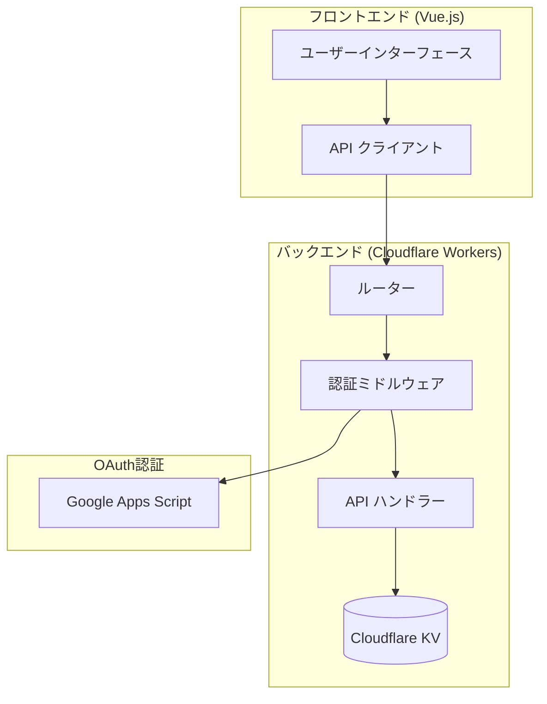

# Flexio - 匿名チャットプラットフォーム

完全匿名のチャットプラットフォームと、RFC 6749準拠のOAuth 2.0認証システムを提供します。

> **注**: このプロジェクトは以前 "sphylics" および "bbauth" と呼ばれていました。現在は **Flexio** に統一されています。

## プロジェクト構成

```
flexio/
├── frontend/        # Vue.js 3 フロントエンド
├── workers/         # Cloudflare Workers API (バックエンド)
├── appsscript/      # Google Apps Script 認証レイヤー
├── docs/            # API ドキュメント
└── SETUP.md         # セットアップガイド
```

## ✨ 主な機能

### チャット機能
- 🔒 **完全匿名** - 個人情報不要でチャット参加
- 📝 **マークダウン対応** - リッチなテキスト表現
- 👍 **リアクションシステム** - 30種類以上の常設リアクション + 季節限定リアクション
- 🏷️ **ロールベース権限** - Owner, Manager, Entrant, Audience など
- 📊 **信頼スコア** - チャットの信頼性を可視化
- 🔍 **検索・タグ機能** - チャットを簡単に発見

### セキュリティ
- 🔐 **RFC 6749準拠 OAuth 2.0**
- ✅ **PKCE必須** (RFC 7636)
- 🔑 **ES256 JWT署名**
- 🛡️ **レート制限** (60 req/min)
- 📋 **レポート・モデレーション機能**

### 技術スタック

**フロントエンド:**
- Vue.js 3 (Composition API)
- Vue Router 4
- Vite 7
- Tailwind CSS 3
- Markdown-it
- Material Design Icons

**バックエンド:**
- Cloudflare Workers (TypeScript)
- Cloudflare KV (データストレージ)
- Google Apps Script (OAuth認証)
- OpenAPI 3.0仕様

## 🏗️ アーキテクチャ



## 🚀 クイックスタート

詳細なセットアップ手順は [SETUP.md](SETUP.md) を参照してください。

### 1. フロントエンドの起動

```bash
cd frontend
npm install
npm run dev
```

フロントエンドは `http://localhost:5173` で起動します。

### 2. バックエンド（Workers）の起動

```bash
cd workers
npm install
npm run dev
```

Workers APIは `http://localhost:8787` で起動します。

### 3. Google Apps Script の設定（オプション）

OAuth認証を使用する場合は、Google Apps Scriptのデプロイが必要です。
詳細は [SETUP.md](SETUP.md) を参照してください。

## 📚 ドキュメント

- **[SETUP.md](SETUP.md)** - セットアップガイド（詳細）
- **[docs/API_REFERENCE.md](docs/API_REFERENCE.md)** - API仕様
- **[docs/ARCHITECTURE.md](docs/ARCHITECTURE.md)** - システムアーキテクチャ
- **[docs/SECURITY.md](docs/SECURITY.md)** - セキュリティ設計
- **[docs/CHAT_API.md](docs/CHAT_API.md)** - チャットAPI仕様
- **[workers/openapi.yaml](workers/openapi.yaml)** - OpenAPI 3.0仕様

## 📄 ページ一覧

### メイン機能
- `/` - トップページ
- `/chat/:chatId` - チャットルーム
- `/dashboard` - ダッシュボード
- `/newchat` - 新規チャット作成
- `/joinchat` - チャット参加
- `/search` - チャット検索

### 情報ページ
- `/about` - Flexioについて
- `/faq` - よくある質問
- `/devs` - 開発者向けAPI ドキュメント
- `/stats` - 統計情報
- `/information` - お知らせ
- `/newfunctionlab` - 新機能ラボ

### アカウント・管理
- `/newaccount` - アカウント作成
- `/admin` - 管理者ページ

### その他
- `/policy` - プライバシーポリシー
- `/terms` - 利用規約
- `/inquiry` - お問い合わせ
- `/jobs` - 採用情報
- `/error` - エラーページ

## 🚧 実装状況

### ✅ 実装済み
- [x] Workers API（完全実装）
  - [x] OAuth 2.0エンドポイント
  - [x] チャット管理API
  - [x] コメント管理API
  - [x] リアクションAPI
  - [x] レポート・モデレーションAPI
  - [x] 管理者API
- [x] フロントエンドUI（完全実装）
  - [x] 20ページのUI
  - [x] ダークモード対応
  - [x] マークダウンレンダリング
- [x] 型定義（TypeScript）
- [x] OpenAPI 3.0仕様書
- [x] ドキュメント

### 🚧 進行中
- [ ] フロントエンド ↔ Workers API統合
  - [x] API クライアント作成
  - [ ] 各ページのAPI統合
- [ ] OAuth 2.0フロー（現在はlocalStorageのみ）

### 📋 今後の予定
- [ ] リアルタイム通信（WebSocket）
- [ ] オフライン対応
- [ ] テストスイート
- [ ] CI/CD パイプライン

## 🤝 コントリビューション

プルリクエストを歓迎します！大きな変更の場合は、まずissueを開いて変更内容を議論してください。

## 📝 ライセンス

MIT License - 詳細は [LICENSE](LICENSE) を参照してください。

## 📧 お問い合わせ

- GitHub Issues: [https://github.com/your-username/flexio/issues](https://github.com/your-username/flexio/issues)
- Email: contact@example.com
