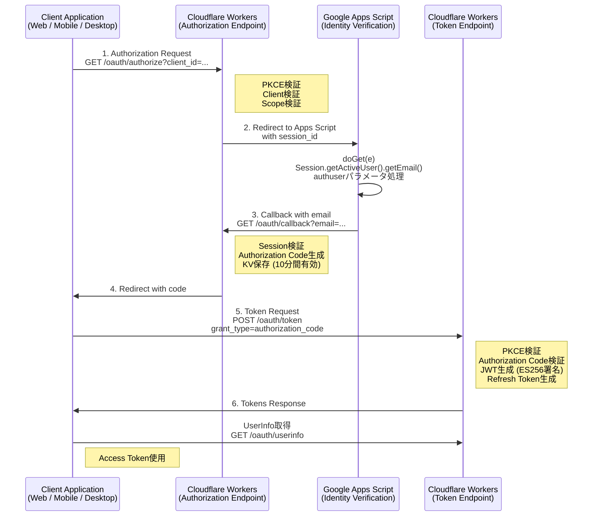
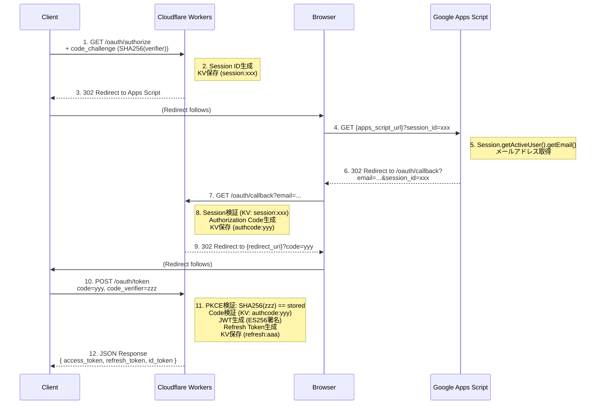

# bbauth Architecture

## システムアーキテクチャ図



---

## コンポーネント詳細

### 1. Cloudflare Workers (OAuth Business Logic)

**責任:**
- OAuth 2.0フロー制御
- PKCE検証
- JWT生成・検証
- クライアント認証
- スコープ検証

**使用技術:**
- TypeScript
- Web Crypto API (ES256, Ed25519)
- Cloudflare KV (データ永続化)

**エンドポイント:**
- `GET /oauth/authorize` - 認可開始
- `GET /oauth/callback` - Apps Scriptコールバック
- `POST /oauth/token` - トークン発行
- `GET /oauth/userinfo` - ユーザー情報取得
- `GET /.well-known/openid-configuration` - Discovery
- `GET /.well-known/jwks.json` - 公開鍵

---

### 2. Google Apps Script (Identity Verification)

**責任:**
- ユーザー認証（Session.getActiveUser()）
- メールアドレス取得
- OAuth Scope実行（Gmail, Drive）
- authuser パラメータ処理

**使用技術:**
- Google Apps Script (JavaScript)
- GmailApp, DriveApp APIs

**制約:**
- Path-based routing不可（URL Parametersのみ）
- Crypto API不可（署名はWorkers側）
- 「アクセスしたユーザーで実行」モード必須

---

### 3. Cloudflare KV (データストレージ)

**保存データ:**

| Key | Value | TTL |
|-----|-------|-----|
| `authcode:{code}` | AuthorizationCodeData | 600秒 (10分) |
| `refresh:{token}` | RefreshTokenData | 2592000秒 (30日) |
| `client:{clientId}` | ClientData | 永続 |
| `provider:{providerId}` | ProviderData | 永続 |
| `session:{sessionId}` | SessionData | 600秒 (10分) |

**特性:**
- Eventual Consistency（書き込み後すぐ読めない場合あり）
- Global分散（Edge最適化）

---

## データフロー詳細

### Authorization Code Flow



---

## セキュリティレイヤー

### Layer 1: ネットワーク層

- **TLS 1.3**: すべての通信を暗号化
- **Cloudflare DDoS保護**: 自動攻撃検知

### Layer 2: 認証層

- **OAuth 2.0**: 標準準拠の認証フロー
- **PKCE**: Authorization Code横取り防止
- **State parameter**: CSRF対策

### Layer 3: 暗号化層

- **ES256 (JWT)**: ECDSA P-256 + SHA-256
- **Ed25519 (Provider ID)**: 高速署名検証

### Layer 4: アクセス制御層

- **Scope-based**: 細かい権限制御
- **Client Registration**: 事前登録制
- **Token Expiration**: 短命トークン

---

## スケーラビリティ

### Cloudflare Workers

- **自動スケーリング**: リクエスト数に応じて自動拡張
- **グローバル分散**: 200以上のエッジロケーション
- **コールドスタート**: 0ms（V8 Isolates）

### Cloudflare KV

- **Eventual Consistency**: 書き込み後数秒で全リージョン反映
- **読み取り最適化**: エッジキャッシュ
- **容量**: 実質無制限

### Google Apps Script

- **実行クォータ**: 1日あたり90分/ユーザー
- **同時実行**: 30リクエスト/秒
- **ボトルネック**: Session.getActiveUser() は高速

---

## 可用性

### SLA

- **Cloudflare Workers**: 99.99% (公式SLA)
- **Google Apps Script**: 99.9%
- **合計**: 99.89%（直列接続）

### フェイルオーバー

```
Primary Apps Script
     ↓ (障害時)
Fallback Apps Script (別アカウント)
```

---

## モニタリング

### Cloudflare Analytics

- リクエスト数
- エラー率
- レイテンシ
- 帯域幅

### Apps Script Logs

- `Logger.log()` → Stackdriver Logging
- エラートレース
- 実行時間

---

## 将来の拡張

### Phase 2

- [ ] Multiple Identity Providers（複数IdP対応）
- [ ] Dynamic Client Registration（RFC 7591）
- [ ] Token Introspection（RFC 7662）

### Phase 3

- [ ] OpenID Connect Full Certification
- [ ] SAML 2.0 Bridge
- [ ] FIDO2 Support

---

## パフォーマンス

### 平均レイテンシ

| Endpoint | P50 | P95 | P99 |
|----------|-----|-----|-----|
| /oauth/authorize | 50ms | 100ms | 200ms |
| /oauth/token | 30ms | 80ms | 150ms |
| /oauth/userinfo | 20ms | 50ms | 100ms |

### ボトルネック

1. **Apps Script往復**: 300-500ms
   - 対策: 同意画面キャッシュ（計画中）

2. **KV書き込み**: 50-100ms
   - 対策: Workers Durable Objects検討

---

## Cost Estimation

### Cloudflare Workers

- **無料枠**: 100,000 req/日
- **有料プラン**: $5/月 (10M req)

### Google Apps Script

- **無料**: クォータ内

### 月間100万認証の場合

- Workers: $5
- KV: $0.50
- Apps Script: $0
- **合計: $5.50/月**

---

## References

- [Cloudflare Workers Docs](https://developers.cloudflare.com/workers/)
- [Google Apps Script Reference](https://developers.google.com/apps-script/reference)
- [OAuth 2.0 RFC 6749](https://datatracker.ietf.org/doc/html/rfc6749)
